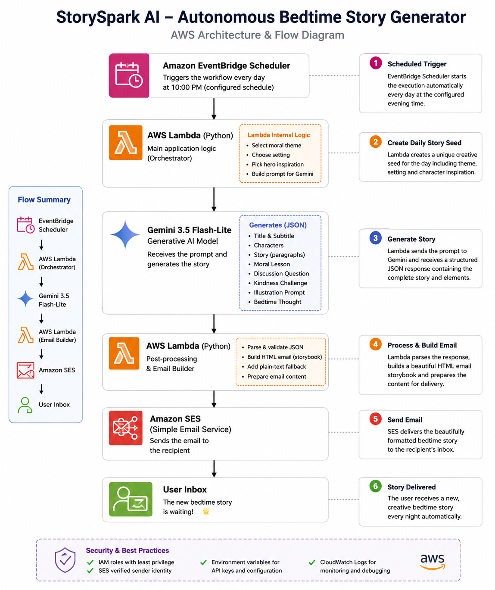
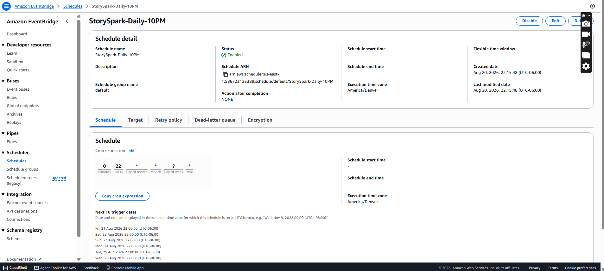
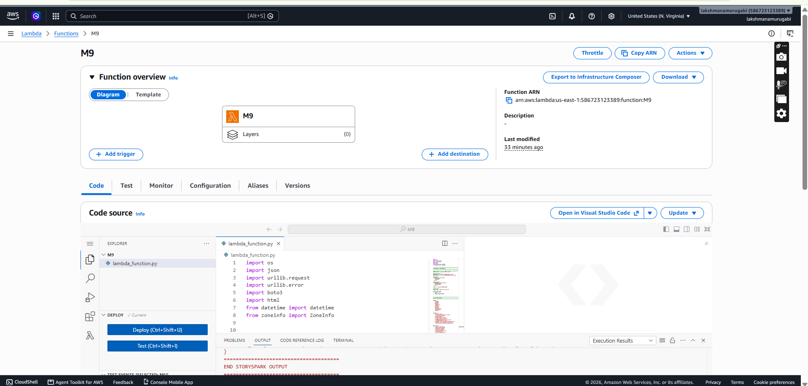
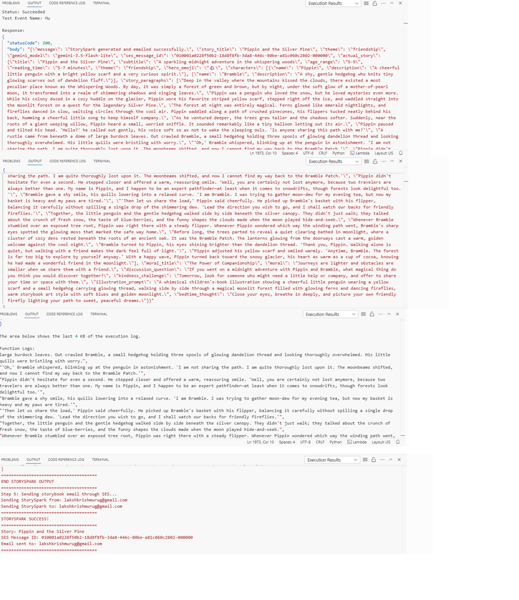
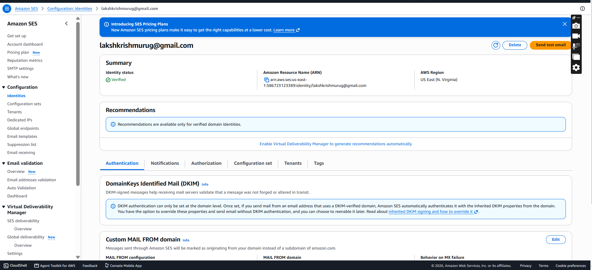

<div align="center">

# 🌙✨ StorySpark AI

### Autonomous Bedtime Story Generation — Delivered While You’re Away

**A new story. A new adventure. Already waiting when you return.**

<br>


<br>

### ⏰ Schedule → ✨ Create → 📖 Format → 📧 Deliver

<br>

**Built for the AWS Builder Center Weekend Creative Agent Challenge**

`#agents`

</div>

---

## 🌟 What is StorySpark AI?

Most generative AI applications wait for the user.

You open an application, enter a prompt, press a button, and wait for something to be generated.

**StorySpark AI works differently.**

StorySpark is an autonomous bedtime-story workflow that automatically wakes up every evening, creates a completely new children's story, transforms it into a polished storybook-style email, and delivers it directly to an inbox.

Once the schedule is configured:

> **There is no daily prompt to enter and no Generate button to press.**

The creative work happens automatically while the user is away.

When the user returns, a new bedtime adventure is already waiting.

---

## ✨ What StorySpark Creates

Each execution can produce a complete bedtime-story experience containing:

| | StorySpark Content |
|---|---|
| 📖 | Original children's bedtime story |
| 🐧 | Original characters |
| 🌲 | New setting and adventure |
| ❤️ | Meaningful moral |
| 💬 | Parent-child discussion question |
| 🌞 | Next-day kindness challenge |
| 🎨 | Children's-book illustration prompt |
| 🌙 | Peaceful bedtime thought |
| ✉️ | Premium storybook-style HTML email |

The current version is designed primarily for children approximately **5–9 years old**.

---

# 📬 StorySpark in Action

Below is an example of an actual StorySpark story generated by the workflow and delivered through Amazon SES.

<p align="center">
  
</p>

<p align="center">
  <em>Example of a generated StorySpark bedtime story delivered to the inbox.</em>
</p>

<div align="center">

### 📄 Complete Story Output

**[Open the full StorySpark email output as PDF](docs/screenshots/storyspark-email-output-full.pdf)**

</div>

---

# ⚡ The Autonomous Idea

The most important part of StorySpark is not simply that AI creates a story.

The important part is that **the user does not have to request the story every day**.

Amazon EventBridge Scheduler automatically starts StorySpark at the configured time.

For the deployed project:

```text
Schedule Name : StorySpark-Daily-10PM
Schedule      : Daily
Time          : 10:00 PM
Time Zone     : America/Denver
Payload       : {}
Status        : Enabled
```

The empty payload is intentional.

```json
{}
```

EventBridge does not tell StorySpark what story to create.

Instead, StorySpark creates its own daily creative direction after Lambda starts.

---

# 🔄 How StorySpark Works

```text
┌───────────────────────────────┐
│ Amazon EventBridge Scheduler  │
│                               │
│ Every evening • 10:00 PM      │
│ America/Denver                │
└───────────────┬───────────────┘
                │
                ▼
┌───────────────────────────────┐
│ AWS Lambda                    │
│ StorySpark Orchestrator       │
│                               │
│ • Generate daily seed         │
│ • Select theme                │
│ • Select setting              │
│ • Select hero inspiration     │
│ • Build AI prompt             │
└───────────────┬───────────────┘
                │
                ▼
┌───────────────────────────────┐
│ Gemini 3.5 Flash-Lite         │
│                               │
│ Generates original structured│
│ bedtime-story JSON            │
└───────────────┬───────────────┘
                │
                │ Story JSON
                ▼
┌───────────────────────────────┐
│ AWS Lambda                    │
│                               │
│ • Parse JSON                  │
│ • Validate content            │
│ • Build HTML storybook        │
│ • Create plain-text fallback  │
└───────────────┬───────────────┘
                │
                ▼
┌───────────────────────────────┐
│ Amazon SES                    │
│                               │
│ Sends completed story email   │
└───────────────┬───────────────┘
                │
                ▼
         📬 USER INBOX

     New story waiting.
     No button press required.
```

---

# 🏗️ AWS Architecture

<p align="center">
  
</p>

<p align="center">
  <em>StorySpark autonomous generation and delivery architecture.</em>
</p>

The architecture intentionally keeps the AWS workflow focused and serverless.

### Amazon EventBridge Scheduler

Provides the recurring trigger that starts the workflow automatically.

### AWS Lambda

Acts as the main StorySpark orchestrator.

Lambda handles:

```text
Daily creative seed
        ↓
Prompt creation
        ↓
Gemini API request
        ↓
JSON validation
        ↓
HTML story creation
        ↓
Amazon SES delivery request
```

### Gemini 3.5 Flash-Lite

Gemini is the external generative AI service used to create the original bedtime-story content.

### Amazon SES

Amazon Simple Email Service delivers the finished storybook email to the configured recipient.

### Amazon CloudWatch

Lambda execution information is available through CloudWatch Logs for monitoring and troubleshooting.

---

# ☁️ Technology Stack

| Technology | Purpose |
|---|---|
| **Amazon EventBridge Scheduler** | Automatic nightly execution |
| **AWS Lambda** | Serverless orchestration and application logic |
| **Amazon SES** | Storybook email delivery |
| **Amazon CloudWatch** | Execution logging and troubleshooting |
| **Python** | Application implementation |
| **Gemini 3.5 Flash-Lite** | Generative story creation |
| **HTML Email** | Storybook-style presentation |

---

# 🎲 Daily Creative Seed

StorySpark does not require the user to manually choose a story every evening.

When Lambda starts, the application creates a daily creative seed containing elements such as:

```text
Date
Weekday
Theme
Setting
Hero inspiration
```

Example themes include:

```text
Kindness
Courage
Patience
Honesty
Friendship
Empathy
Curiosity
Teamwork
Gratitude
Responsibility
Perseverance
Sharing
```

Possible environments include imaginative locations such as:

```text
Moonlit forest
Floating island
Tiny seaside village
Magical garden
Mountain valley
Hidden woodland library
Lighthouse
Firefly farm
Dreamland train
Glowing-flower valley
```

Hero inspiration can include characters such as:

```text
Curious little fox
Gentle young elephant
Brave little rabbit
Thoughtful young owl
Playful red panda
Tiny adventurous turtle
Kind little bear
Cheerful little penguin
Shy young deer
Friendly young otter
```

This provides creative variation while keeping StorySpark autonomous.

---

# 🤖 Structured AI Generation

StorySpark asks Gemini to return structured JSON instead of unrestricted text.

A typical response follows this structure:

```json
{
  "title": "Story title",
  "subtitle": "Story subtitle",
  "age_range": "5-9",
  "reading_time": "5-7 minutes",
  "theme": "friendship",
  "hero_emoji": "🐧",
  "characters": [
    {
      "name": "Character name",
      "description": "Character description"
    }
  ],
  "story_paragraphs": [
    "Story paragraph..."
  ],
  "moral_title": "Moral title",
  "moral": "Meaningful lesson",
  "discussion_question": "Parent-child discussion question",
  "kindness_challenge": "Tomorrow's action challenge",
  "illustration_prompt": "Detailed illustration prompt",
  "bedtime_thought": "Gentle final bedtime thought"
}
```

Structured output gives Lambda predictable fields that can be validated and transformed into the final email.

---

# 🛡️ Child-Friendly Story Rules

StorySpark's generation instructions emphasize original and age-appropriate content.

The prompt asks the model to avoid:

```text
❌ Copyrighted franchise characters
❌ Famous book imitation
❌ Recognizable movie or television characters
❌ Brand references
❌ Graphic violence
❌ Frightening horror
❌ Adult themes
❌ Political content
❌ Religious persuasion
```

Instead, stories focus on:

```text
✅ Imagination
✅ Friendship
✅ Kindness
✅ Courage
✅ Curiosity
✅ Emotional warmth
✅ Gentle challenges
✅ Meaningful choices
✅ Hopeful endings
```

---

# 🧩 Response Validation

AI output is not passed directly into the email.

StorySpark first processes the response inside Lambda.

The application:

```text
Gemini Response
      │
      ▼
Remove accidental code fences
      │
      ▼
Extract JSON
      │
      ▼
Parse JSON
      │
      ▼
Validate required fields
      │
      ▼
Normalize paragraphs
      │
      ▼
Normalize character data
      │
      ▼
Apply fallback values where appropriate
      │
      ▼
Build HTML Storybook
```

This creates a more reliable workflow than simply emailing raw AI output.

---

# 📖 Storybook Email Design

After validation, Lambda transforms the generated content into a custom HTML email.

The final experience contains sections for:

```text
🌙 Story title
✨ Subtitle
👧 Age range
⏱️ Reading time
❤️ Theme
⭐ Characters
📖 Main adventure
❤️ Moral
💬 Discussion question
🌞 Tomorrow's challenge
🎨 Illustration prompt
🌙 Bedtime thought
⚡ Autonomous workflow indicator
```

A plain-text fallback is also created for email clients that cannot render HTML.

---

# ✅ AWS Deployment Evidence

This repository contains screenshots and sample artifacts from the deployed StorySpark workflow.

The purpose of this section is to demonstrate that StorySpark is not only source code.

It has been configured and executed using AWS services.

---

## 1️⃣ EventBridge Scheduler — Enabled

<p align="center">
  
</p>

The deployed recurring schedule shows:

```text
Schedule : StorySpark-Daily-10PM
Status   : Enabled
Cron     : 0 22 * * ? *
Timezone : America/Denver
```

This provides the always-on behavior of StorySpark.

---

## 2️⃣ EventBridge → Lambda Target

Amazon EventBridge Scheduler invokes the StorySpark Lambda function automatically.

```text
StorySpark-Daily-10PM
          │
          ▼
      AWS Lambda
          │
          ▼
          M9
```

The scheduler sends:

```json
{}
```

StorySpark then generates its own creative context.

---

## 3️⃣ AWS Lambda Application

<p align="center">
  
</p>

The Python Lambda function contains the complete StorySpark orchestration workflow.

---

## 4️⃣ Successful Lambda Execution

<p align="center">
  
</p>

A successful execution demonstrates:

```text
Status: Succeeded

statusCode: 200

Story generated successfully

HTML email created successfully

Amazon SES send request successful

STORYSPARK SUCCESS
```

A sanitized text version is included here:

### 📋 [View Sample Execution Log](evidence/sample-execution-log.txt)

---

## 5️⃣ Amazon SES Verified Identity

<p align="center">
  
</p>

Amazon SES uses a verified sender identity for StorySpark delivery.

Sensitive account information has been removed or should be redacted from public screenshots.

---

# 🌙 Real Generated Story

This repository includes a real StorySpark-generated bedtime story:

## **Pippin and the Glowing Nightcap**

> *A cozy midnight adventure in the Silver-Pine Woods*

| Attribute | Value |
|---|---|
| **Age Range** | 5–9 |
| **Reading Time** | 5–7 minutes |
| **Theme** | Friendship |
| **Characters** | Pippin, Bramble and Pip |
| **Lesson** | The Power of Togetherness |

Explore the generated artifacts:

### 📖 [Read the Complete Story](examples/sample-story.md)

### 🧩 [View the Generated JSON](evidence/sample-output.json)

### 📋 [View the Execution Evidence](evidence/sample-execution-log.txt)

### 📄 [View the Full StorySpark Email PDF](docs/screenshots/storyspark-email-output-full.pdf)

---

# 📂 Repository Structure

```text
StorySpark-AI/
│
├── README.md
├── lambda_function.py
├── .gitignore
├── .env.example
│
├── docs/
│   │
│   ├── architecture/
│   │   └── storyspark-aws-flow.png
│   │
│   └── screenshots/
│       ├── 01-lambda-function.png
│       ├── 02-eventbridge-schedule.png
│       ├── 03-lambda-success-log.png
│       ├── 04-ses-verified-identity.png
│       ├── 05-storyspark-email-output.jpg
│       └── storyspark-email-output-full.pdf
│
├── evidence/
│   ├── sample-execution-log.txt
│   └── sample-output.json
│
└── examples/
    └── sample-story.md
```

---

# 🚀 Deployment

## Step 1 — Create AWS Lambda

Create a Python Lambda function and deploy:

```text
lambda_function.py
```

Handler:

```text
lambda_function.lambda_handler
```

---

## Step 2 — Configure Environment Variables

The repository includes:

```text
.env.example
```

Example:

```env
M9=YOUR_GEMINI_API_KEY_HERE

SENDER_EMAIL=YOUR_SES_VERIFIED_EMAIL@example.com

RECIPIENT_EMAIL=YOUR_RECIPIENT_EMAIL@example.com

SES_REGION=us-east-1

TIMEZONE_NAME=America/Denver
```

> `M9` is the environment-variable name used by the current deployed version for the Gemini API key.

Do not put the real Gemini API key inside the repository.

---

## Step 3 — Configure Amazon SES

Create and verify the email identity used by StorySpark.

```text
Amazon SES
     │
     ▼
Configuration
     │
     ▼
Identities
     │
     ▼
Create Identity
     │
     ▼
Email Address
     │
     ▼
Verify
     │
     ▼
✅ Verified
```

The Lambda execution role must also have permission to send email through SES.

---

## Step 4 — Configure EventBridge Scheduler

Create a recurring EventBridge Scheduler schedule.

Configuration used by this deployment:

```text
Schedule Name       : StorySpark-Daily-10PM
Schedule Type       : Cron-based
Cron Expression     : 0 22 * * ? *
Execution Time Zone : America/Denver
Flexible Window     : Off
Target              : AWS Lambda
Payload             : {}
```

Equivalent expression:

```text
cron(0 22 * * ? *)
```

---

## Step 5 — Test StorySpark

The complete execution should follow:

```text
EventBridge
     │
     ▼
Lambda starts
     │
     ▼
Daily seed created
     │
     ▼
Gemini called
     │
     ▼
Story JSON returned
     │
     ▼
JSON validated
     │
     ▼
HTML storybook generated
     │
     ▼
Amazon SES
     │
     ▼
📬 Story delivered
```

---

# 🔐 Security

Secrets are intentionally excluded from this repository.

Never commit:

```text
❌ Gemini API key

❌ AWS Access Key ID

❌ AWS Secret Access Key

❌ AWS session tokens

❌ Passwords

❌ Real .env files

❌ Private credentials
```

StorySpark uses environment variables and AWS IAM permissions instead.

Public screenshots should also avoid exposing:

```text
AWS account IDs
Full sensitive ARNs
API keys
Personal email addresses
Private identifiers
```

---

# 🧠 What I Learned

Building StorySpark reinforced an important idea:

> **The generative model is only one part of an autonomous application.**

Generating a story is the creative step.

Making that story appear automatically requires much more:

```text
Scheduling
     +
Serverless Execution
     +
AI Generation
     +
Structured Output
     +
Validation
     +
Formatting
     +
Permissions
     +
Delivery
     =
StorySpark AI
```

During development, I worked through practical issues involving model availability, Lambda execution time, API-response handling, Amazon SES permissions, sender verification, and scheduled execution.

Solving those pieces transformed StorySpark from a manual prototype into a complete automated workflow.

---

# 🔮 Future Improvements

StorySpark currently focuses on reliably completing the autonomous creative loop:

> **Schedule → Create → Format → Deliver**

Future versions could explore:

- 🎨 Actual AI-generated story illustrations
- 🧠 Lightweight story memory
- 🐧 Recurring original characters
- 📚 Multi-part adventures
- 🎂 Adjustable age ranges
- 👨‍👩‍👧 Parent-selected themes
- 🌎 Multi-language stories
- 🪣 Amazon S3 story archives
- 🗄️ Amazon DynamoDB story history
- 🌐 Web-based story library
- 📊 Enhanced observability
- 🚨 Failure notifications

---

# 🏆 AWS Builder Center Weekend Creative Agent Challenge

StorySpark AI was created for the:

### **AWS Builder Center Weekend Creative Agent Challenge**

The project explores the concept of an **always-on creative agent** that generates something new independently and has the result waiting when the user returns.

### 📝 Builder Center Article

**Weekend Creative Agent Challenge: StorySpark AI**

`#agents`

> Add the published AWS Builder Center article URL here after publication.

---

# 👨‍💻 Author

<div align="center">

### Lakshmanaprakash Murugesan

Built with curiosity, serverless technology, generative AI, and a little bedtime magic.

</div>

---

<div align="center">

# 🌙 StorySpark AI

### Imagine • Create • Inspire

**Every evening begins with an empty page.**

**Every night ends with a new adventure waiting in the inbox.**

<br>

### ⏰ → ☁️ → ✨ → 📖 → 📧

**Schedule → Create → Format → Deliver**

<br>

Made with ☁️ **AWS** + 🤖 **Generative AI**

</div>